<!-- ═══════════════════════════  HEADER  ═══════════════════════════ -->
<p align="center">
  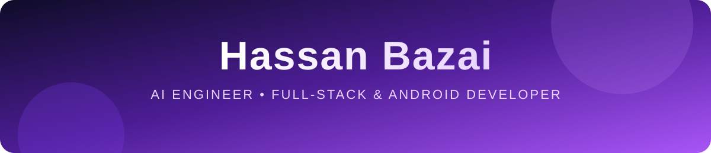
</p>

<p align="center">
  <a href="https://github.com/BazaiHassan">
    
  </a>
</p>

<p align="center">
  <a href="mailto:bazaee.hassan@gmail.com"></a>
  <a href="https://hbazai.github.io"></a>
  <a href="https://github.com/BazaiHassan?tab=repositories"></a>
</p>

<br>

<!-- ═══════════════════════════  ABOUT  ═══════════════════════════ -->
### 👨‍💻 About me

```kotlin
object HassanBazai {
    val role       = listOf("AI Engineer", "Full-Stack Dev", "Android Dev")
    val building   = "Web app for datasets & AI pipelines marketplace"
    val languages  = listOf("Kotlin", "Python", "TypeScript", "Rust", "Java")
    val loves      = listOf("Clean Architecture", "LLM Agents", "CFD", "MLOps")
    val funFact    = "I am Funny 😄"
    val contact    = "bazaee.hassan@gmail.com"
}
```

- 🔭 Currently building a **web app for datasets & AI pipelines marketplace**
- 🌊 Building **offline, on-device AI** apps (speech-to-text, voice analysis)
- 📱 Shipping native **Android apps** with Kotlin & Jetpack Compose
- 🦀 Learning **Rust** for fun and speed
- ⚡ Fun fact: **I am Funny**

<p align="center">
  
</p>

<!-- ═══════════════════════════  APPS  ═══════════════════════════ -->
## 📲 My Apps on Cafe Bazaar

<p align="center"><i>Native Android apps I designed and built, live on <a href="https://cafebazaar.ir">Cafe Bazaar</a></i></p>

<table>
<tr>
<td width="190" align="center" valign="top">
<br>

<h3>ریاضی‌جو</h3>
<sub><b>Riazi-Joo</b></sub>
<br><br>
<a href="https://cafebazaar.ir/app/ir.riazijoo.app"></a>
</td>
<td valign="top">
<br>
Math learning for <b>grades 1 to 12</b>. All lessons, exercises, exams, missions and review cards are generated by an engine from one knowledge bank: <b>84 chapters, 144 topics, 489 exercise templates</b>, with SM-2 spaced repetition.
<br><br>
<code>Kotlin</code> <code>Compose Multiplatform</code> <code>Android · iOS · Desktop</code><br><br>
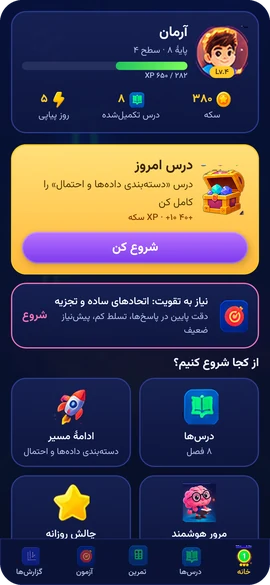&nbsp;
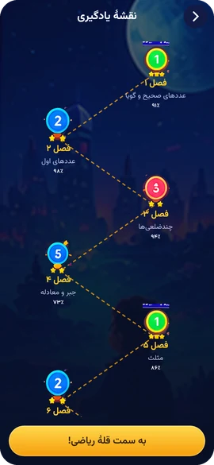&nbsp;
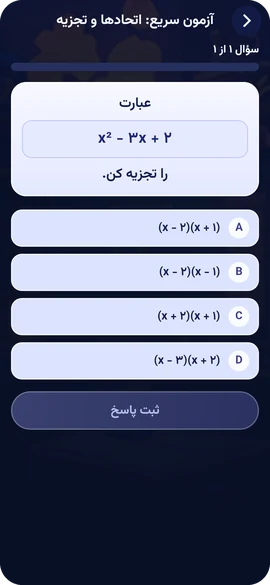
</td>
</tr>
<tr>
<td width="190" align="center" valign="top">
<br>

<h3>شیمی‌جو</h3>
<sub><b>Shimi-Joo</b></sub>
<br><br>
<a href="https://cafebazaar.ir/app/ir.shimijoo"></a>
</td>
<td valign="top">
<br>
Gamified, fully <b>offline</b> high-school chemistry (grades 10–12). Questions, levels, exams and games are generated on the device, with <b>automatic equation balancing</b> and 52 question generators whose wrong answers come from common misconceptions.
<br><br>
<code>Kotlin</code> <code>Compose Multiplatform</code> <code>Offline</code><br><br>
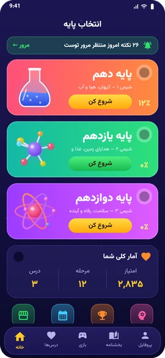&nbsp;
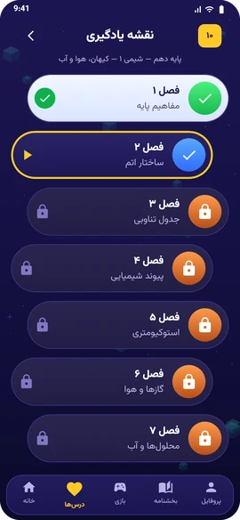&nbsp;
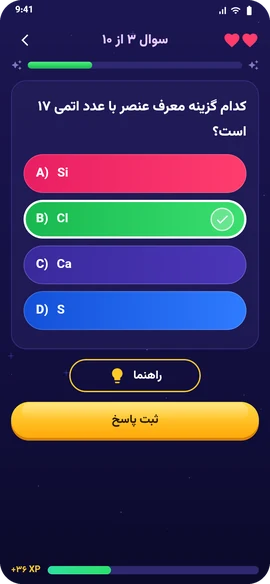
</td>
</tr>
<tr>
<td width="190" align="center" valign="top">
<br>

<h3>نبرد ذهن</h3>
<sub><b>Nebard-e Zehn</b></sub>
<br><br>
<a href="https://cafebazaar.ir/app/com.nebardezehn.app"></a>
</td>
<td valign="top">
<br>
An offline <b>brain-training game</b> with an endless level generator for memory, focus, speed and logic, plus missions, achievements, a shop and daily lessons.
<br><br>
<code>Kotlin</code> <code>Compose Multiplatform</code> <code>Game</code><br><br>
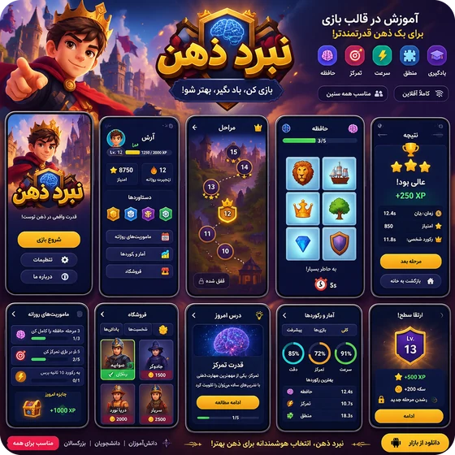
</td>
</tr>
<tr>
<td width="190" align="center" valign="top">
<br>

<h3>میرا</h3>
<sub><b>Meera</b></sub>
<br><br>
<a href="https://cafebazaar.ir/app/com.hbazai.mirraapp"></a>
</td>
<td valign="top">
<br>
Book appointments at the <b>nearest beauty salons and clinics</b>. Find top-rated specialists anywhere in the city, compare by user reviews and book in seconds. Built for customers, stylists and salon owners. Companion app of <a href="https://meera24.ir">meera24.ir</a>.
<br><br>
<code>Kotlin</code> <code>Jetpack Compose</code> <code>Maps & Location</code>
<br><br>
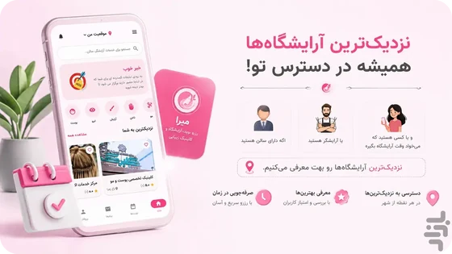
</td>
</tr>
<tr>
<td width="190" align="center" valign="top">
<br>

<h3>آوانویس</h3>
<sub><b>Avanevis</b></sub>
<br><br>
<a href="https://cafebazaar.ir/app/ir.avanevis.app"></a>
</td>
<td valign="top">
<br>
Offline <b>Persian speech-to-text</b>. Turns Telegram voice messages, audio files or live recordings into Persian text <b>without internet</b>, so the audio never leaves the phone.
<br><br>
<code>Kotlin</code> <code>Jetpack Compose</code> <code>sherpa-onnx</code> <code>On-device AI</code><br><br>
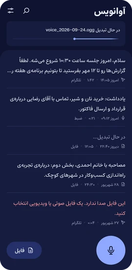&nbsp;
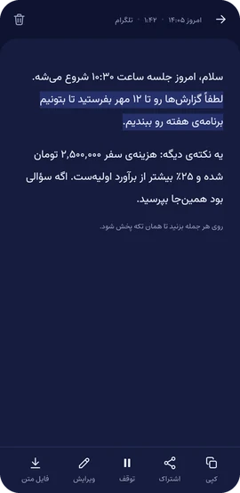&nbsp;
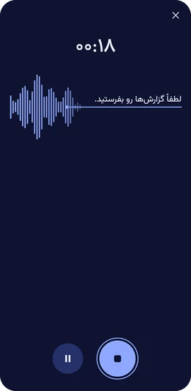
</td>
</tr>
<tr>
<td width="190" align="center" valign="top">
<br>

<h3>آوازه</h3>
<sub><b>Avazeh</b></sub>
<br><br>
<a href="https://cafebazaar.ir/app/ir.avazeh"></a>
</td>
<td valign="top">
<br>
Calm, focus, progress: <b>offline voice & speech analysis</b>. It builds your <b>voice profile</b> (warmth, clarity, rhythm, articulation…), shows your strengths, and coaches you with <b>targeted, step-by-step exercises</b>, a silence/room test and personalized feedback.
<br><br>
<code>Kotlin</code> <code>Jetpack Compose</code> <code>C++ DSP (NDK)</code>
<br><br>

</td>
</tr>
<tr>
<td width="190" align="center" valign="top">
<br>

<h3>ازبر قرآن</h3>
<sub><b>Azbar Quran</b></sub>
<br><br>
<a href="https://cafebazaar.ir/app/ir.azbar.app"></a>
</td>
<td valign="top">
<br>
Your companion for <b>memorizing and learning the Quran</b>: recitation with translation, beautiful recitations by renowned reciters, audio translation, a dedicated <b>memorization & practice</b> section, offline downloads and a simple, calm interface.
<br><br>
<code>Kotlin</code> <code>Jetpack Compose</code> <code>Audio</code>
<br><br>
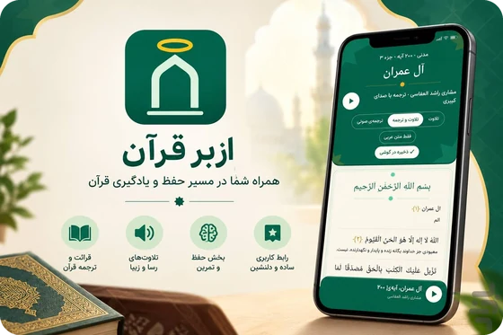
</td>
</tr>
</table>

<!-- ═══════════════════════════  WEBSITES  ═══════════════════════════ -->
## 🌐 Websites I've Built

<table>
<tr>
<td width="50%" valign="top">
<h3>💇‍♀️ Meera24</h3>
<p>Online booking for <b>beauty salons and clinics</b>: find the nearest, best-rated specialists and book an appointment, with an admin panel for businesses.</p>
<p><code>Python</code> <code>Docker</code> <code>Jenkins</code></p>
<p><a href="https://meera24.ir"></a></p>
</td>
<td width="50%" valign="top">
<h3>🎬 Klipa</h3>
<p>A Persian-first <b>AI video generation SaaS</b>. From an idea, text, article link or template, it generates the script, scenes, images, voice, music, subtitles and the final MP4.</p>
<p><code>Python</code> <code>GenAI</code> <code>Docker</code></p>
<p><a href="https://klipa.ir"></a></p>
</td>
</tr>
<tr>
<td width="50%" valign="top">
<h3>🧠 MLGrid</h3>
<p>A <b>dataset and AI pipelines marketplace</b> for machine-learning teams.</p>
<p><code>Nuxt</code> <code>Python</code> <code>AI</code></p>
<p><a href="https://mlgrid.com"></a></p>
</td>
<td width="50%" valign="top">
<h3>🛍️ Arshimal</h3>
<p>A multi-vendor <b>online marketplace</b> with seller shops, products, cart and checkout, comments and seller payouts.</p>
<p><code>Nuxt</code> <code>TypeScript</code> <code>SEO</code></p>
<p><a href="https://arshimal.ir"></a></p>
</td>
</tr>
</table>

<!-- ═══════════════════════════  STACK  ═══════════════════════════ -->
## 🧰 Tech Stack

<p align="center">
  <b>Languages</b><br><br>
  
</p>
<p align="center">
  <b>Mobile</b><br><br>
  
</p>
<p align="center">
  <b>Backend & Data</b><br><br>
  
</p>
<p align="center">
  <b>Frontend</b><br><br>
  
</p>
<p align="center">
  <b>AI / ML & DevOps</b><br><br>
  
</p>

<!-- ═══════════════════════════  FEATURED  ═══════════════════════════ -->
## 🌟 Featured Projects

<table>
<tr>
<td width="50%" valign="top">
<h3>📚 <a href="https://github.com/BazaiHassan/cmp_book_app">CMP Book App</a></h3>
<p>A book app built with <b>Compose Multiplatform</b> — one Kotlin codebase, multiple platforms.</p>
<p> </p>
</td>
<td width="50%" valign="top">
<h3>🎓 <a href="https://github.com/BazaiHassan/lms-app">LMS App</a></h3>
<p>A learning management system: <b>FastAPI + Postgres + Alembic + Pydantic + Docker</b> with a Streamlit UI.</p>
<p>  </p>
</td>
</tr>
<tr>
<td width="50%" valign="top">
<h3>🔐 <a href="https://github.com/BazaiHassan/Password-Manger">Password Manager</a></h3>
<p>A <b>self-hosted</b> password manager — your secrets, your server.</p>
<p></p>
</td>
<td width="50%" valign="top">
<h3>🦀 <a href="https://github.com/BazaiHassan/mizan">Mizan</a></h3>
<p>My latest experiment in <b>Rust</b> — fast, safe and fearless.</p>
<p></p>
</td>
</tr>
<tr>
<td width="50%" valign="top">
<h3>📝 <a href="https://github.com/BazaiHassan/NoteApp">NoteApp</a></h3>
<p>Notes app with <b>Jetpack Compose</b>, Clean Architecture and Dagger-Hilt.</p>
<p> </p>
</td>
<td width="50%" valign="top">
<h3>🎧 <a href="https://github.com/BazaiHassan/musicod">Musicod</a></h3>
<p>An online platform for <b>listening to music</b>, built with Vue.</p>
<p></p>
</td>
</tr>
</table>

<!-- ═══════════════════════════  ALL PROJECTS  ═══════════════════════════ -->
## 🗂️ All Projects

<p align="center">
  
  
</p>

> Click a category to expand it 👇 &nbsp;·&nbsp; 🔒 = private repository

<details>
<summary><b>🚀 Products & Platforms</b> &nbsp;·&nbsp; 22 projects</summary>
<br>

| Project | Description | Stack |
|:--|:--|:--|
| 🔒 **arshimal** | Arshimal — online marketplace · [arshimal.ir](https://arshimal.ir) | `Product` |
| 🔒 **arshimal-website** | Arshimal storefront website | `Vue` |
| 🔒 **arshimal-backend** | Arshimal marketplace backend & API | `TypeScript` |
| 🔒 **mirra24-android-app** | Meera Android app — salon & clinic booking · [Cafe Bazaar](https://cafebazaar.ir/app/com.hbazai.mirraapp) | `Kotlin` |
| 🔒 **mirra24-web-backend** | Meera24 backend & admin panel · [meera24.ir](https://meera24.ir) | `Python` |
| 🔒 **mlmond.com** | MLMond — data mining & dataset marketplace | `Vue` |
| 🔒 **mlmond-frontend** | MLMond frontend | `Vue` |
| 🔒 **mlmond-backend** | MLMond backend | `Python` |
| 🔒 **mlmond-app** | MLMond app | `Vue` |
| 🔒 **mlmond-newface** | MLMond redesign | `Vue` |
| 🔒 **mlmondNuxt** | MLMond on Nuxt | `Nuxt` |
| 🔒 **mlmond-nuxt-vercel** | MLMond Nuxt deployment | `Nuxt` `Vercel` |
| 🔒 **mlmond-backend-django** | MLMond Django backend | `Django` `Vercel` |
| 🔒 **mlmond-vue-website** | MLMond Vue website | `Vue` |
| 🔒 **temp_mlmond_front** | MLMond frontend prototype | `Vue` |
| 🔒 **mlmond** | MLMond data mining website (v1) | `HTML` |
| 🔒 **datadeh-new-frontend** | Datadeh frontend | `TypeScript` |
| 🔒 **codedu** | Coding education platform | `Vue` |
| 🔒 **lms_free_project** | Free LMS project | `Vue` |
| 🔒 **PersianTrello** | Persian Trello-style task board | `Vue` |
| 🔒 **grill-land** | Grill Land restaurant website | `Vue` |
| 🔒 **shika_style** | Shika Style fashion shop | `Vue` |

</details>

<details>
<summary><b>🤖 AI · Machine Learning · Automation</b> &nbsp;·&nbsp; 17 projects</summary>
<br>

| Project | Description | Stack |
|:--|:--|:--|
| [**my-ai-models**](https://github.com/BazaiHassan/my-ai-models) | My collection of trained AI models | `ML` |
| [**tesnorflow-DeepLearning**](https://github.com/BazaiHassan/tesnorflow-DeepLearning) | Deep learning experiments & notebooks | `TensorFlow` `Jupyter` |
| [**cfd**](https://github.com/BazaiHassan/cfd) | Computational fluid dynamics notebooks | `Jupyter` `NumPy` |
| [**llm-chat-app-template**](https://github.com/BazaiHassan/llm-chat-app-template) | Chat app template for LLMs | `JavaScript` `LLM` |
| [**botrader**](https://github.com/BazaiHassan/botrader) | Automated trading bot | `Python` |
| [**insta-downloader-bot**](https://github.com/BazaiHassan/insta-downloader-bot) | Instagram downloader bot | `Python` `Bot` |
| 🔒 **Kipa-Project** | Klipa — AI video generation SaaS · [klipa.ir](https://klipa.ir) | `Python` `GenAI` |
| 🔒 **SpeechDatasetMaker** | Toolkit for building speech datasets | `Python` `Speech` |
| 🔒 **SRS-Bot** | A robot for trading | `Python` `Trading` |
| 🔒 **gpt-builder** | Build custom GPT assistants | `Python` `LLM` |
| 🔒 **parhamGPT** | GPT-powered Android assistant | `Kotlin` `LLM` |
| 🔒 **learn-ai-agents** | Hands-on AI agents experiments | `Python` `Agents` |
| 🔒 **quizra** | Quiz generation platform | `Python` |
| 🔒 **AlgorithmPlayground** | Having fun with algorithms in Python | `Jupyter` |
| 🔒 **mond-scrapper** | Data scraper for MLMond | `Python` `Scraping` |
| 🔒 **phishing-project** | Phishing research project | `Python` `Security` |
| 🔒 **cfdup** | CFD application | `Java` |

</details>

<details>
<summary><b>🛠️ Tools · Systems · DevOps</b> &nbsp;·&nbsp; 7 projects</summary>
<br>

| Project | Description | Stack |
|:--|:--|:--|
| [**mizan**](https://github.com/BazaiHassan/mizan) | Systems project written in Rust | `Rust` |
| [**TermBridge**](https://github.com/BazaiHassan/TermBridge) | Terminal bridge app | `Kotlin` |
| [**Password-Manger**](https://github.com/BazaiHassan/Password-Manger) | Self-hosted password manager | `TypeScript` |
| [**android-builder-scafold-script**](https://github.com/BazaiHassan/android-builder-scafold-script) | Scaffold & build Android projects from a script | `Shell` |
| [**fastapi_generator**](https://github.com/BazaiHassan/fastapi_generator) | Generator for FastAPI project boilerplate | `Shell` `FastAPI` |
| [**heroku-xray-ws-server**](https://github.com/BazaiHassan/heroku-xray-ws-server) | Xray WebSocket server for Heroku | `Shell` `Docker` |
| 🔒 **whatsapp-marketing-app** | WhatsApp marketing automation | `TypeScript` |

</details>

<details>
<summary><b>⚙️ Backend & APIs</b> &nbsp;·&nbsp; 8 projects</summary>
<br>

| Project | Description | Stack |
|:--|:--|:--|
| [**lms-app**](https://github.com/BazaiHassan/lms-app) | LMS — FastAPI + Postgres + Alembic + Pydantic + Docker + Streamlit UI | `FastAPI` `PostgreSQL` `Docker` |
| [**fastapi**](https://github.com/BazaiHassan/fastapi) | FastAPI playground | `Python` `FastAPI` |
| [**fastapi-tu**](https://github.com/BazaiHassan/fastapi-tu) | FastAPI tutorial exercises | `Python` `FastAPI` |
| [**chatApp**](https://github.com/BazaiHassan/chatApp) | Real-time chat with Flask & sockets | `Flask` `Socket.IO` |
| [**djangoPersonalPage**](https://github.com/BazaiHassan/djangoPersonalPage) | Personal page built with Django | `Django` |
| [**django_user_login_register**](https://github.com/BazaiHassan/django_user_login_register) | User login & registration with Django | `Django` |
| 🔒 **mlmondapi** | MLMond REST API | `Python` |
| 🔒 **shop_front_backend** | Online shop — frontend + backend | `HTML` `Fullstack` |

</details>

<details>
<summary><b>🌐 Web Frontend</b> &nbsp;·&nbsp; 7 projects</summary>
<br>

| Project | Description | Stack |
|:--|:--|:--|
| [**musicod**](https://github.com/BazaiHassan/musicod) | Online platform for listening to music | `Vue` |
| [**twitter-clone**](https://github.com/BazaiHassan/twitter-clone) | Twitter clone | `Vue` |
| [**nuxt-auth**](https://github.com/BazaiHassan/nuxt-auth) | User auth logic with Nuxt & Supabase | `Nuxt` `Supabase` |
| [**dastyar-nuxt-app**](https://github.com/BazaiHassan/dastyar-nuxt-app) | Dastyar web app | `Nuxt` |
| [**golbarg-app**](https://github.com/BazaiHassan/golbarg-app) | Golbarg web app | `Vue` |
| [**hbazai.github.io**](https://github.com/BazaiHassan/hbazai.github.io) | Personal website | `TypeScript` |
| [**todo-android-vue**](https://github.com/BazaiHassan/todo-android-vue) | Todo app for Android built with Vue | `Vue` `TypeScript` `Capacitor` |

</details>

<details>
<summary><b>📱 Android · Kotlin · Jetpack Compose</b> &nbsp;·&nbsp; 40 projects</summary>
<br>

| Project | Description | Stack |
|:--|:--|:--|
| [**NoteApp**](https://github.com/BazaiHassan/NoteApp) | Notes app — Compose, Clean Architecture, Dagger-Hilt | `Compose` `Hilt` |
| [**mvvm-di-room-retroft**](https://github.com/BazaiHassan/mvvm-di-room-retroft) | Best practice of MVVM, Room, Retrofit, Hilt, Flow, Coroutines | `Kotlin` `MVVM` |
| [**cmp_book_app**](https://github.com/BazaiHassan/cmp_book_app) | Book app with Compose Multiplatform | `KMP` `Compose` |
| [**ShoppingListAndroidApp**](https://github.com/BazaiHassan/ShoppingListAndroidApp) | A beautiful shopping list app with Room | `Kotlin` `Room` |
| [**LittleLemonApp**](https://github.com/BazaiHassan/LittleLemonApp) | Restaurant app built with Jetpack Compose | `Compose` |
| [**composeGmailUI**](https://github.com/BazaiHassan/composeGmailUI) | Gmail UI recreated in Compose | `Compose` |
| [**MyCarServices**](https://github.com/BazaiHassan/MyCarServices) | Car services app | `Kotlin` |
| [**industerial_report_app**](https://github.com/BazaiHassan/industerial_report_app) | Industrial reporting app | `Kotlin` |
| [**simple-mvvm-news-app**](https://github.com/BazaiHassan/simple-mvvm-news-app) | Simple MVVM news app | `Kotlin` `MVVM` |
| [**jetpack-compose-navigation-drawer**](https://github.com/BazaiHassan/jetpack-compose-navigation-drawer) | Navigation drawer in Jetpack Compose | `Compose` |
| [**navigation-fragment**](https://github.com/BazaiHassan/navigation-fragment) | Transactions between fragments | `Kotlin` |
| [**MVVM_simple**](https://github.com/BazaiHassan/MVVM_simple) | A minimal MVVM example | `Kotlin` `MVVM` |
| [**MVVM_Retrofit**](https://github.com/BazaiHassan/MVVM_Retrofit) | MVVM architecture fetching remote data | `Java` `Retrofit` |
| [**MVVM_Remote_Local**](https://github.com/BazaiHassan/MVVM_Remote_Local) | MVVM with remote + local data sources | `Java` `Room` |
| [**SimpleSQLLite**](https://github.com/BazaiHassan/SimpleSQLLite) | CRUD with SQLite | `Kotlin` `SQLite` |
| [**CameraTest**](https://github.com/BazaiHassan/CameraTest) | Camera API playground | `Kotlin` |
| [**walking_app_kotlin**](https://github.com/BazaiHassan/walking_app_kotlin) | Walking / step app | `Kotlin` |
| [**dice_roll_kotlin**](https://github.com/BazaiHassan/dice_roll_kotlin) | Dice roller | `Kotlin` |
| [**bodoApp**](https://github.com/BazaiHassan/bodoApp) | Bodo app | `Kotlin` |
| [**AwesomeToastLibrary**](https://github.com/BazaiHassan/AwesomeToastLibrary) | Custom toast library for Android | `Kotlin` `Library` |
| [**customSnackBar**](https://github.com/BazaiHassan/customSnackBar) | Custom Snackbar component | `Kotlin` `Library` |
| 🔒 **shimi-joo** | Shimi-Joo — gamified offline chemistry · [Cafe Bazaar](https://cafebazaar.ir/app/ir.shimijoo) | `Compose Multiplatform` |
| 🔒 **Riazi-Joo** | Riazi-Joo — math learning for grades 1–12 · [Cafe Bazaar](https://cafebazaar.ir/app/ir.riazijoo.app) | `Compose Multiplatform` |
| 🔒 **nebarde-zehn** | Nebard-e Zehn — brain-training game · [Cafe Bazaar](https://cafebazaar.ir/app/com.nebardezehn.app) | `Compose Multiplatform` |
| 🔒 **me-claude-apps** | Android apps monorepo: Avanevis, Khana, Avazeh | `Kotlin` `Compose` |
| 🔒 **Keep-Fit-App** | Fitness tracking app | `Kotlin` |
| 🔒 **HBPlayer** | Media player | `Kotlin` |
| 🔒 **cartat** | Cartat app | `Kotlin` |
| 🔒 **Bookan** | Book app | `Kotlin` |
| 🔒 **ketabhat-app** | Ketabhat book app | `Kotlin` |
| 🔒 **mimify** | Mimify app | `Kotlin` |
| 🔒 **TinTinArtApp** | Art app | `Kotlin` |
| 🔒 **dr-plant** | Plant doctor app | `Kotlin` |
| 🔒 **HamyarTamin** | HamyarTamin app | `Kotlin` |
| 🔒 **foodrecepieapp** | Food recipe app | `Kotlin` |
| 🔒 **newsApp** | News app — MVVM, Retrofit, Dagger-Hilt, Room | `Kotlin` `Hilt` |
| 🔒 **jakar** | Handyman application | `Kotlin` |
| 🔒 **JakarWorker** | Worker app of Jakar | `Kotlin` |
| 🔒 **ckarApp** | Online job app | `Kotlin` |
| 🔒 **ourJobApp** | Job app | `Kotlin` |

</details>

<details>
<summary><b>🎮 Games</b> &nbsp;·&nbsp; 7 projects</summary>
<br>

| Project | Description | Stack |
|:--|:--|:--|
| [**Mastermind-Game**](https://github.com/BazaiHassan/Mastermind-Game) | Classic Mastermind puzzle | `Kotlin` |
| [**jackTheGiant**](https://github.com/BazaiHassan/jackTheGiant) | Jack the Giant — a Java game | `Java` `libGDX` |
| [**javafx-carGame**](https://github.com/BazaiHassan/javafx-carGame) | Desktop car game made for fun | `JavaFX` |
| [**sfs-game**](https://github.com/BazaiHassan/sfs-game) | SFS game | `Java` |
| 🔒 **pingpong** | A ping-pong game | `Java` |
| 🔒 **birdhunting** | Bird hunting game | `Java` |
| 🔒 **clicker-app** | Clicker game | `Docker` |

</details>

<!-- ═══════════════════════════  STATS  ═══════════════════════════ -->
## 📊 GitHub Stats

<p align="center">
  
  
</p>

<p align="center">
  
</p>

<p align="center">
  
</p>

<!-- ═══════════════════════════  SNAKE  ═══════════════════════════ -->
<p align="center">
  <picture>
    <source media="(prefers-color-scheme: dark)" srcset="https://raw.githubusercontent.com/BazaiHassan/BazaiHassan/output/github-snake-dark.svg" />
    <source media="(prefers-color-scheme: light)" srcset="https://raw.githubusercontent.com/BazaiHassan/BazaiHassan/output/github-snake.svg" />
    
  </picture>
</p>

<!-- ═══════════════════════════  FOOTER  ═══════════════════════════ -->
<p align="center">
  <i>“Talk is cheap. Show me the code.”</i> — Linus Torvalds
</p>

<p align="center">
  
</p>
